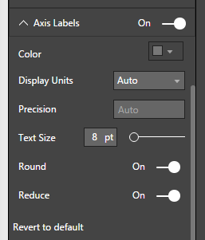

# Tachometer Capability Options

## AxisLabels

## Axis Labels - Default Settings
Axis Labels are the labels that are placed along the gauge arc indicating values at intervals that are determined by Capability settings. Figure 1 and Figure 2 shows Axis Labels Settings and a Sample screenshot of Tachometer with default Axis Labels when Gauge Axis Scale is set to Linear Scale (please refer [Gauge Axis](GaugeAxis.md) examples for more Axis Scale). 

| Figure 1. “Axis Labels” Default Option Settings when Linear scale is used. | Figure 2. Tachometer with default settings for Axis Labels when Linear Scale is used. |
|---|---|
|   |  |

## Axis Labels - Default Settings – For Log Scale
Figure 3 and Figure 4 show Axis Labels Settings and a Sample screenshot of Tachometer with default Axis Labels when Gauge Axis Scale is set to Log Scale (please refer [Gauge Axis](GaugeAxis.md) examples for more Axis Scale). 

Notice that when Log Scale is used, you do not get the “Count” option by default. Instead, you get the “Reduce” Option. Please refer rest of this section on Axis Labels for more details on these.

| Figure 3. “Axis Labels” Default Option Settings when Log scale is used. | Figure 4. Tachometer with default settings for Axis Labels when Linear Log is used. |
|---|---|
|   |  |

|Option|Default Value|Description|
|---|---|---|
|Show|True|On/Off Switch to display “Axis Labels”|
|Color|Grey|Color of “Axis Labels” Text|
|Text Size|8 pt|Size of “Axis Labels” Text|
|Display Units|Auto|Specify whether to show the value as Thousands, Millions etc.|
|Precision|Auto|Number of decimal places to show|
|Round|True|Round label values for better visualization.|
|Count|4|Approximate count of labels to display. Not Applicable when Log Gauge Axis Scale is set to “Log”.|
|Reduce|True|Applicable only when Gauge Axis Scale is set to “Log”. This can be used to avoid overcrowding labels|

## Axis Labels - Label Color, Display Units and Text Size
Following example shows customized Label Color, Display Units and Text Size settings. In this example, the Color of Axis Labels is set to a Green shade, Display Units set to “Thousands” and Text Size set to 15 pt. 

Note that the target value also inherits the Display Unit settings. 

| Figure 5. Axis Label Color, Display Units and Text Size customized | Figure 6. Tachometer with customized Label Color, Display Units and Text Size |
|---|---|
|   |  |

## Axis Labels - Round
“Round” option is used to switch on and off creating nice rounded label values. By default, “Round” is switched On. In the following example “Round” option is switched Off. This results in placement of labels at equal intervals along the gauge. The number of labels placed would match the “Count” option when Axis Scale is set to Linear.

Note that with Linear Axis Scale, when “Round” is switched On, the number of labels does not exactly match the count but will be close. This is because there may not be enough nicely rounded positions along the arc for the given Start Value and End Value.

| Figure 7. “Round” switched Off. | Figure 8. Tachometer with equally spaced axis labels because of “Round” switching Off |
|---|---|
|   |  |

## Axis Labels - Count
The number of labels that will be displayed along the Tachometer Axis is defined by “Count”. By default, Count is set to 4. “Count” is only visible with Linear Axis Scale.
If “Round” is switched On, Tachometer will place nicely rounded labels. However, the number of labels may not match exactly with the “Count” specified. This is because there may not be enough nicely rounded positions along the arc for the given Start Value and End Value.

| Figure 9. “Count” Set to 8 in Axis Labels | Figure 10. Tachometer with approximately 8 Axis Labels |
|---|---|
|   |  |

## Axis Labels - Reduce
“Reduce” option shown in Figure 3 is only available when Axis Scale is set to Log Scale. This option helps limit label overcrowding. If the labels are not too close, this option will have no effect. By default, “Reduce” option is switched On. 

