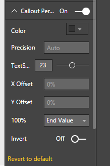
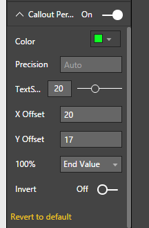
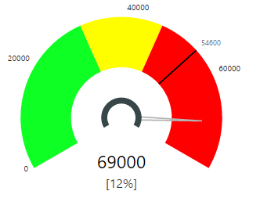

# Tachometer Capability Options

## Callout Percent

## Callout Percent - Default Settings
Callout Percent is the data label that show the current value as a percent of the axis range. Axis Range is the difference between the Start Value and the End Value. Callout Percent can be shown or hidden using the On/Off switch just to the right of “Callout Percent” shown in Figure 1. Callout Percent is hidden by default.

| Figure 1. “Callout Percent” Switched On with default values for other options | Figure 2. Tachometer with default settings for Callout Percent when switched On |
|---|---|
|   |  |

|Option|Default Value|Description|
|---|---|---|
|Show|False|On/Off switch to display “Callout Percent”|
|Color|Grey|Color of “Callout Percent” Text.|
|Text Size|14 pt|Size of “Callout Percent” Text.|
|Precision|Auto|Number of decimal places to show|
|X Offset|0% of Width|Horizontal percent displacement of Callout Percent from default position|
|Y Offset|0% of Height|Vertical percent displacement of Callout Percent from default position|

## Callout Percent - Color, Display Units and Text Size
Following example shows customized Color, Display Units and Text Size settings for Callout Percent. In this example, the Color of Callout Value is set to a Green shade and Text Size set to 25 pt. 

| Figure 3. Color, Display Units and Text Size customized for Callout Percent | Figure 4. Tachometer with customized Color, Display Units and Text Size for Callout Percent |
|---|---|
|   |  |

## Callout Percent - X Offset and Y Offset
Tachometer places the Callout Percent at the bottom center of your visual’s view port just below Callout Value by default. You can change this using X Offset and Y Offset values. With X Offset you can move the Callout Percent horizontally by a percentage of view port width. With Y Offset you can move the Callout Percent vertically by a percentage of viewport height. Percentages are used to minimize the need for user intervention when viewport is resized.

To make an intuitive user experience, positive values will move X Offset towards the right while negative values will move X Offset left. Similarly, positive values will move Y Offset up while negative values will move Y offset down from its original position.

Following example shows how placement of the Callout Percent can be customized with X Offset and Y Offset options. In addition to Callout Percent Options, some settings were also changed in Callout Value settings as well for this example to move Callout Value left from its default position.

| Figure 5. Offset Set to 20% and Y Offset Set to 17% to move the Callout Percent from its default to desired position. | Figure 6. Tachometer with Callout Percent placed at a different position from its default (bottom middle) using X Offset and Y Offset. |
|---|---|
|   |  |

## Callout Percent - Invert
There are times when you want to display the percent displacement from End Value rather than the default Start Value. This is also true when you switch your Start Value and End Value in Data Role Settings to invert the orientation of the gauge face. “Invert” option can be used to show the percentage value as a difference from 100%. 

When Invert is set to True, Tachometer will display 100 – Percentage Value as the value of Callout Percent as shown below. In this example, the calculated percent value is 88%, after inversion it becomes 100 – 88 = 12%.

| Figure 7. “Invert” Switched On for Callout Percent | Figure 8. Tachometer with Callout Percent Inverted. |
|---|---|
|   |  |

