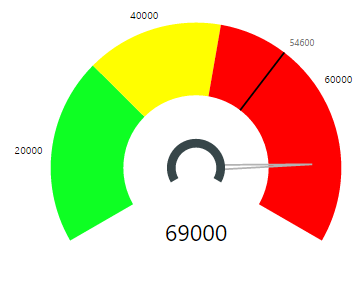

# Tachometer Capability Options

## Callout Value

## Callout Value - Default Settings
Callout Value is the data label that show the current value pointed by the needle. Callout Value can be shown or hidden using the On/Off switch just to the right of “Callout Value” shown in Figure 1. Callout value is shown by default.

| Figure 1. “Callout Value” Default Option Settings. | Figure 2. Tachometer with default settings for Callout Value |
|---|---|
|   |  |

|Option|Default Value|Description|
|---|---|---|
|Show|True|On/Off Switch to display “Callout Value”|
|Color|Black|Color of “Callout Value” Text|
|Text Size|20 pt|Size of “Callout Value” Text|
|Display Units|Auto|Specify whether to show the value as Thousands, Millions etc.|
|Precision|Auto|Number of decimal places to show|
|X Offset|0 %|Horizontal percent displacement of Callout Percent from default position|
|Y Offset|0 %|Vertical percent displacement of Callout Percent from default position|

## Callout Value - Color, Display Units and Text Size
Following example shows customized Color, Display Units and Text Size settings for Callout Value. In this example, the Color of Callout Value is set to a Green shade, Display Units set to “Thousands” and Text Size set to 40 pt. 

| Figure 3. Color, Display Units and Text Size customized for Callout Value | Figure 4. Tachometer with customized Color, Display Units and Text Size for Callout Value |
|---|---|
|   |  |

## Callout Value - X Offset and Y Offset
Tachometer places the Callout Value at the bottom center of your visual’s view port by default. You can change this using X Offset and Y Offset values. With X Offset you can move the Callout Value horizontally by a percentage of view port width. With Y Offset you can move the Callout Value vertically by a percentage of viewport height. Percentages are used to minimize the need for user intervention when viewport is resized.

To make an intuitive user experience, positive values will move X Offset towards the right while negative values will move X Offset left. Similarly, positive values will move Y Offset up while negative values will move Y offset down from its original position.

Following example shows how placement of the Callout Value can be customized with X Offset and Y Offset options. In addition to Callout Options, the Start Angle and End Angle of the dial were also changed in Gauge Axis settings to demonstrate this feature for this example.

| Figure 5. X Offset Set to 60% and Y Offset Set to 62% to move the Callout Value from its default to desired position. | Figure 6. Tachometer with Callout Value placed at a different position from its default (bottom middle) using X Offset and Y Offset. |
|---|---|
|   |  |

