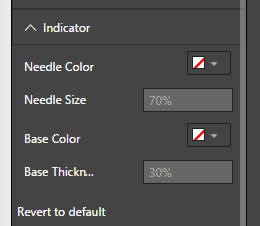
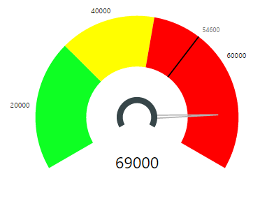
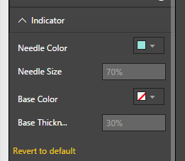
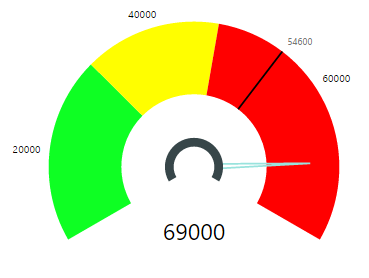
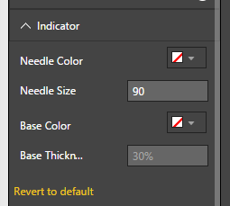
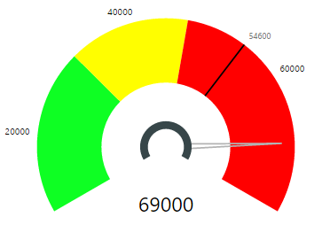
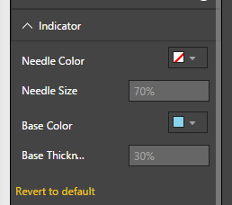
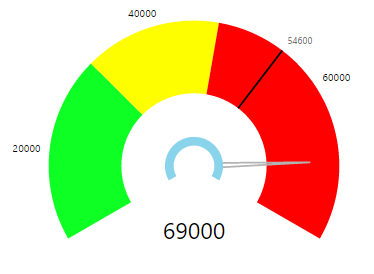
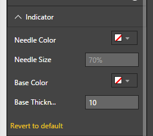
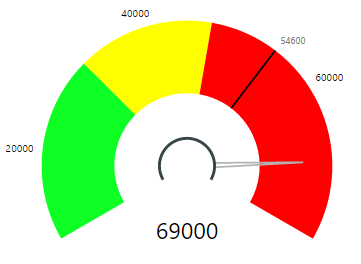


# Tachometer Capability Options

## Indicator

## Indicator - Default Settings
In Tachometer, Indicator includes the Needle and its Base. Figure 1 below shows “Indicator” Capability Options. All the values below are set to their defaults. 

| Figure 1. “Indicator” Default Option Settings. | Figure 2. Tachometer with default settings for Indicator|
|---|---|
|   |  |

|Option|Default Value|Description|
|---|---|---|
|Needle Color|Light Grey|Color of the needle|
|Needle Size|70 % of Radius|Distance to needle tip as percentage of gauge radius|
|Base Color|Dark Grey|Color of Indicatorbase arc|
|Base Thickness|30 % of Base Radius|Thickness of Indicatorbase as percentage of its radius|

## Indicator - Needle Color
Color of the needle can be configured using “Needle Color” option. Following is an example showing a customized needle color.

| Figure 3. “Needle Color” set to light blue | Figure 4. Tachometer with Needle Colored light Blue |
|---|---|
|   |  |

## Indicator - Needle Size
Needle Size is defined as a percentage of the gauge Radius. This helps seamless resizing of the Needle when the view port is resized or when Start Angle or End Angle is changed in Gauge Axis Settings. By default, the Needle size is set to 70% of gauge Radius. Following example shows Needle resized to 90%.

Please note that you cannot exceed needle size beyond 100% and cannot go below 0%.

| Figure 5. “Needle Size” set to 90% | Figure 6. Tachometer with Needle size of 90% |
|---|---|
|   |  |

## Indicator - Base Color
Color of the Indicator Base can be configured using “Base Color” option. Following is an example showing a customized base color.

| Figure 7. “Base Color” of Indicator set to light blue | Figure 8. Tachometer with Base Color of light Blue |
|---|---|
|   |  |

## Indicator - Base Thickness
Thickness of the Indicator Base can be configured using “Base Thickness” option. Following is an example showing a customized base thickness. By default, Base Thickness is set to 30% of base Radius.

| Figure 9. Base Thickness” of Indicator set 10% | Figure 10. Tachometer with a 10% Thickness for Indicator Base |
|---|---|
|   |  |
