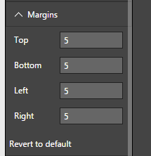


# Tachometer Capability Options

## Margin

## Margin - Default Settings
Figure 1 below shows “Margin” Capability Options. All the values below are set to their defaults. 

Figure 1. “Margin” Default Option Settings 

|Option|Default Value|Min|Max|Description|
|---|---|---|---|---|
|Top|5|0|20|Margin above the dial|
|Bottom|5|0|20|Margin below the dial|
|Left|5|0|20|Margin on left side of the dial|
|Right|5|0|20|Margin on right side of the dial|

