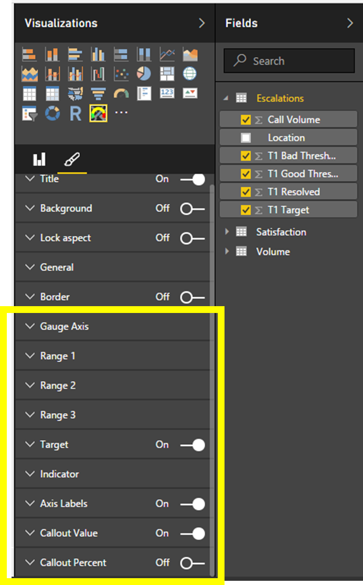


# Tachometer Capability Options

Tachometer Visual provides nine Capability Option groups highlighted in the figure below. These include “Gauge Axis”, “Range 1”, “Range 2”, “Range 3”, “Target”, “Indicator”, “Axis Labels”, “Callout Value” and “Callout Percent”. These Capability Option Groups corresponds to the corresponding components indicated in [Tachometer Components](README.md#tachometer-components). For example, using “Range 2” Capability Option Group you can customize the color, thickness and other attributes of the component “Range 2”. 
Following diagram show Tachometer Capability Options.

Read more about each of the capability options,

 1. [Gauge Axis](GaugeAxis.md)
 2. [Range 1](Range1.md)
 3. [Range 2](Range2.md)
 4. [Range 3](Range3.md)
 5. [Target](Target.md)
 6. [Indicator](Indicator.md)
 7. [Axis Labels](AxisLabels.md)
 8. [Callout Value](CalloutValue.md)
 9. [Callout Percent](CalloutPercent.md)
10. [Margins](Margin.md)

