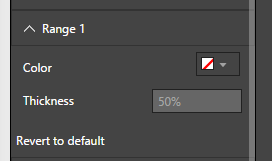
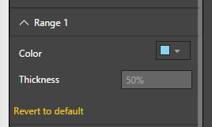
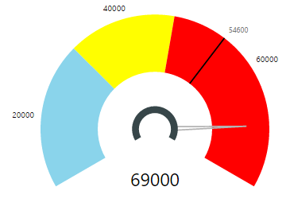
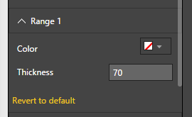
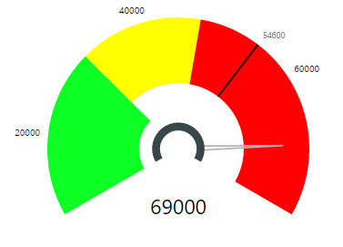


# Tachometer Capability Options

## Range 1

## Range 1 - Default Settings
Figure 1 below shows “Range 1” Capability Options. All the values below are set to their defaults. 

Figure 1. “Range 1” Default Option Settings 

|Option|Default Value|Description|
|---|---|---|
|Color|Green|Color of Range1 arc|
|Thickness|50 % of Radius|Range1 thickness as percentage of gauge radius|

## Range 1 - Color
The Color of any of the 3 Ranges can be changed using their corresponding “Color” Options.  Following Example shows the effect of Changing Color option for Range 1 from its default color (Green) to a shade of Blue.

| Figure 2. Change Range 1 Color | Figure 3. Effect of changing Range 1 Color Option. Now Range 1 is Blue. |
|---|---|
|   |  |

## Range 1 -  Thickness
The Thickness of any of the 3 Ranges can be changed using their corresponding “Thickness” Options.  Following Example shows the effect of Changing Thickness option for Range 1 from its default of 50% to 70% of the calculated Gauge Radius. 

Note. Tachometer Visual calculated the Radius of the gauge based on the Start Angle, End Angle, Height and Width of the view port (or the area available for the visual) to maximize the use of allocated real estate.

| Figure 4. Change Range Thickness. | Figure 5. Effect of changing Range 1 Thickness |
|---|---|
|   |  |
