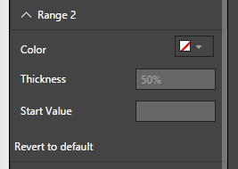
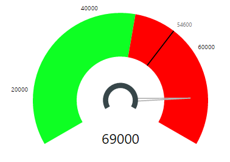
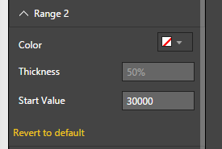
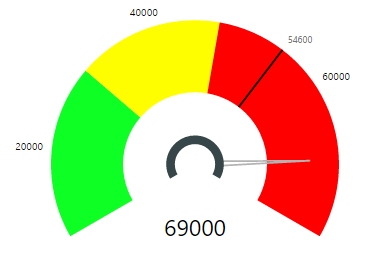


# Tachometer Capability Options

## Range 2

## Range 1 - Default Settings
Figure 1 below shows “Range 2” Capability Options. All the values below are set to their defaults. In addition, we have left the Data Role “Range 2 Start Value” unassigned to demonstrate “Start Value” option for Range 2. 

When Range 2 Start Value is not defined through Data Roles or Capabilities, “Range 1” will extend all the way to “Range 3” if “Range 3” is available. Otherwise Range 1 will occupy the entire gauge axis.

| Figure 1. “Range 2” Default Option Settings | Figure 2. Tachometer with Range 2 not defined. |
|---|---|
|  |  |

|Option|Default Value|Description|
|---|---|---|
|Color|Green|Color of Range2 arc|
|Thickness|50 % of Radius|Range2 thickness as percentage of gauge radius|
|Start Value||Start value for Range2.This will be visible only when there is no Data field assigned for the Data Role “Range 2 Start Value”.|

## Range 2 - Start Value
The Start value for Range 2 can be defined using “Range 2 Start Value” in Data Roles (please refer Section 2 for more on Data Roles). If “Range 2 Start Value” is not set in Data Roles, then you will see the “Start Value” option visible in “Range 2” Capability settings. This allows you to specify a fixed value for Range 2 Start. Following Figures demonstrate an example of Start Value defined through Capability Options

| Figure 3. Set Range 2 “Start Value” to 30000 using Capability Options | Figure 4. Effect of Setting Range 2 Start value through Capability Options. Compare with Figure 2 |
|---|---|
|   |  |

## Range 2 -  Color
Please refer [Range 1 - Color](Range1.md#range-1---color) settings for an example

## Range 2 -  Thickness
Please refer [Range 1 - Thickness](Range1.md#range-1---thickness) settings for an example

