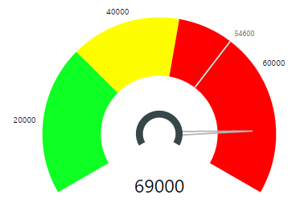

# Tachometer Capability Options

## Target

## Target - Default Settings
Figure 1 below shows “Target” Capability Options. All the values below are set to their defaults. In addition, we have left the Data Role “Target Value” unassigned in getting Figure 2 to show how Tachometer looks like when Target Value is not set. You can get the same effect by switching off the On/Off switch for Target Options (which is on the right of the label “Target” in Figure 1.)

| Figure 1. “Target” Default Option Settings. | Figure 2. Tachometer with default settings for Target and “Target Value” Data Role not set (target not rendered). |
|---|---|
|   |  |

|Option|Default Value|Description|
|---|---|---|
|Show|True|On/Off switch to display Target.|
|Value|Target Value.|This will be visible only when there is no Data Field assigned for the Data Role “Target”.|
|Line Color|Black|Color of the Target line|
|Length|50 % of Radius|Length of target line as percentage of gauge radius|
|Text Color|Grey|Color of Target Text|
|Text Size|8 pt|Size of Target Text|

## Target - Value
A value for Target can be defined using “Target Value” in Data Roles. If “Target Value” is not set in Data Roles, then you will see the “Target Value” option visible in “Target” Capability settings as shown in Figure 1. This allows you to specify a fixed value for Target. Following Figures demonstrate an example of Target Value defined through Capability Options and how it renders the target line.  
Note.Tachometer visual will attempt to position the label indicating target value such that it does not overlap any Axis Labels or Callout values. However, target value label may not be rendered in case Tachometer is unable to relocate target label in the visinity of target line.

| Figure 3. “Value” set to 25000 | Figure 4. Tachometer with Target “Value” set to 25000 and “Target Value: Data Role not set (target not rendered). |
|---|---|
|   |  |

## Target - Line Color
“Line Color” Option of Target Capability Settings helps you define the color of the target. If target is too close to a data label, then target value label will be moved appropriately to avoid overlap and a connecting line will be also added from Target Label to Target Line. This connecting line will also get the same color defined by Line Color.

| Figure 5. “Line Color” set to light blue | Figure 6. Tachometer with Target Line colored blue |
|---|---|
|   |  |

## Target - Length
“Length” Option of Target Capability Settings helps you define the length of the Target Line. The Length is measured as a percentage of the Dial Radius. Dial Radius is calculated when Tachometer is rendered and is based on the Start Angle, and End Angle options in “Gage Axis” capability settings along with Height and Width properties of the view port assigned to the visual on your report or dashboard.

The default value for Length as you can see in Figure 5 is 50% of Radius. However, when default value is used for Length, the actual value will be the smallest of Range 1 and Range 2 and Range 3 Thickness. For example, if Range 1 is set to 40%, Range 2 to 50% and Range 3 to 30%, then target Length will take 30% if you leave Target Length in its default.

| Figure 7. “Length” of Target set to 30%. | Figure 8. Tachometer with Target length of 30%. |
|---|---|
|   |  |

## Target - Text Color and Text Size
Text Color and Text Size of Target Capabilities can be used to set the Color and Size of Target Value label. Following example shows Tachometer Visual with Text Color and Text Size set to custom values.

| Figure 9. “Text Color” of Target set to a green shade and “Text Size” set to 20pt | Figure 10. Tachometer with Text Color and Text Size options set as a green shade and 20pt |
|---|---|
|   |  |

