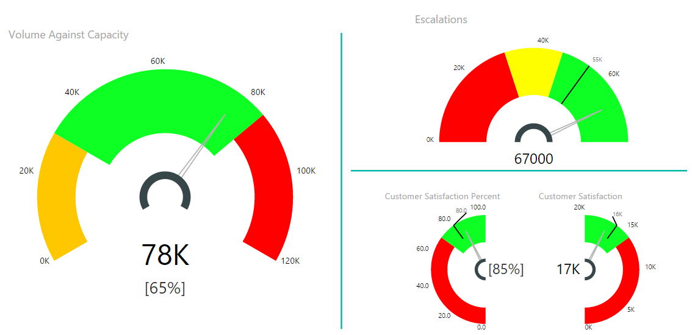
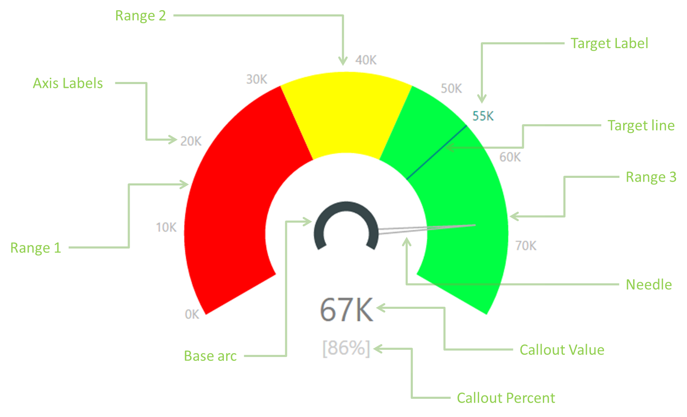
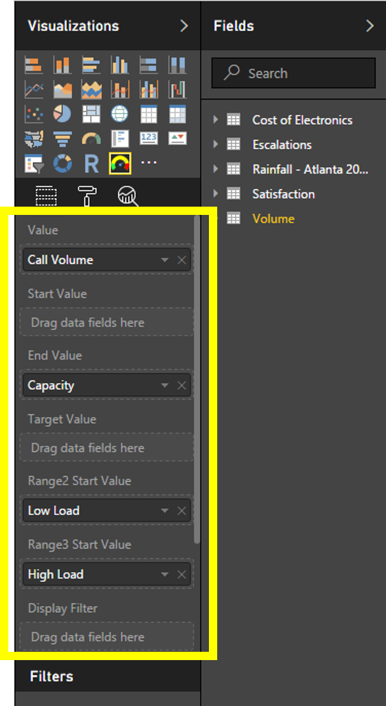
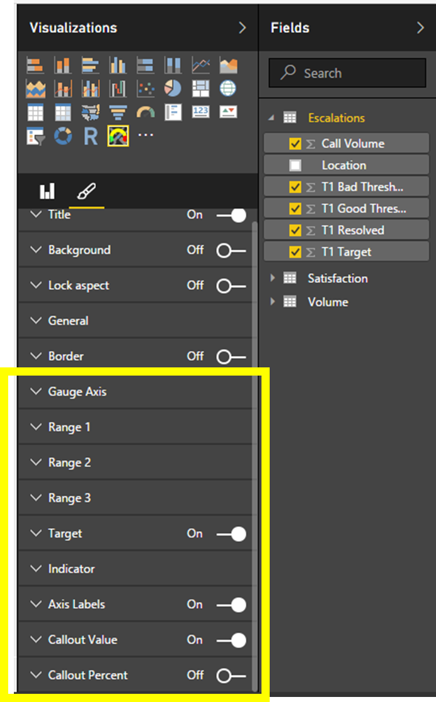

# Tachometer
##Power BI Custom Visual Tachometer

Tachometer is a flexible gauge that allows you to quickly convey detailed information in a way that can be intuitively understood. Many customizable features are included to configure the look and feel as well as behavior; for example, variable start and end angles, configurable orientation, colors, labels, and axis scale.
This is an ideal visual for communicating measures against low,  acceptable, and high components such as team performance against targets, error rates, test coverage, and customer satisfaction.
 
See for yourself [Tachometer Sample Video](https://www.youtube.com/watch?v=C3OXdETbS9o)

Here are some samples of the Tachometer with different settings, 

Learn more...

1. [Tachometer Components](README.md#tachometer-components)
2. [Tachometer Data Roles](README.md#tachometer-data-roles)
3. [Tachometer Capability Options](README.md#tachometer-capability-pptions)

##Tachometer Components

Following are the constituent components of the Tachometer Visual. These are referred in Capability Options and in rest of the documentation.

##Tachometer Data Roles

Following diagram show Tachometer Data Roles.

|Data Role|Description|Constraints|
|---|---|---|
|Value| test description |Tast Value|

##Tachometer Capability Options

Tachometer Visual provides nine Capability Option groups highlighted in the figure below. These include “Gauge Axis”, “Range 1”, “Range 2”, “Range 3”, “Target”, “Indicator”, “Axis Labels”, “Callout Value” and “Callout Percent”. These Capability Option Groups corresponds to the corresponding components indicated in [Tachometer Components](README.md#tachometer-components). For example, using “Range 2” Capability Option Group you can customize the color, thickness and other attributes of the component “Range 2”. 
Following diagram show Tachometer Capability Options.

Learn more about Tachometer Capability Options [here](README.md#Tachometer-Capability-Options).
