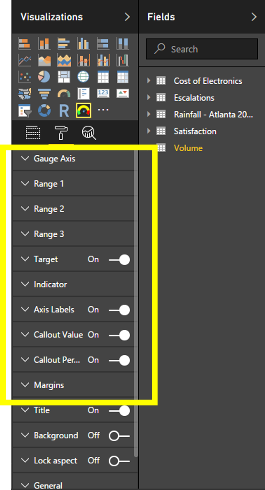

# Tachometer
## Power BI Custom Visual Tachometer

The Tachometer is a flexible gauge that allows you to quickly convey detailed information in a way that can be intuitively understood.  Many customizable features are included to configure the look and feel as well as behavior, for example, variable start and end angles, configurable orientation, colors, labels, and axis scale.  This is an ideal visual for communicating measures against low, acceptable, and high components such as team performance against targets, error rates, test coverage, and customer satisfaction. 

See for yourself [Tachometer Sample Video](https://www.youtube.com/watch?v=C3OXdETbS9o)

Here are some samples of the Tachometer with different settings, 

Learn more...

1. [Tachometer Components](README.md#tachometer-components)
2. [Tachometer Data Roles](README.md#tachometer-data-roles)
3. [Tachometer Capability Options](README.md#tachometer-capability-options)

## Tachometer Components

Following are the constituent components of the Tachometer Visual. These are referred in Capability Options and in rest of the documentation.

## Tachometer Data Roles

Following diagram show Tachometer Data Roles.

|Data Role|Description|Constraints|
|---|---|---|
|Value| This is the value that Tachometer would indicate against the backdrop of other limits and targets defined by remaining Data Roles |Value should be between “Start Value” and “End Value” to be to be displayed on the gauge.|
|Start Value|The Start Value for the Tachometer Arc.|This can either be the minimum value or maximum value in the value range for the Tachometer. All values defined by other Data Roles should lie between Start Value and End Value.|
|End Value|The End Value for the Tachometer Arc|If “Start Value” is the minimum value in the value range, then “End Value” should be the maximum value in the value range or vice versa. All values defined by other Data Roles should lie between Start Value and End Value.|
|Target Value|The Target value that will be displayed by the target line.|Value should be between “Start Value” and “End Value” to be to be displayed on the gauge. Note.Tachometer visual will attempt to position the label indicating target value such that it does not overlap any Axis Labels or Callout values. However, target value label may not be rendered in case Tachometer is unable to relocate target label in the visinity of target line.|
|Range 2 Start Value|This is the starting value for “Range 2”. This is also the End value for Range 1.|Value should be between “Start Value” and “End Value” to be to be displayed on the gauge.In addition, this value should be between “Start Value” and “Range 3 Start Value” when “Range 3 Start Value” is available.|
|Range 3 Start Value|This is the starting value for “Range 3”. This is also the End value for Range 2 when “Range 2 Start Value” is defined. When “Range 2 Start Value” is not provided, this will also be the End Value for Range 1.|Value should be between “Start Value” and “End Value” to be to be displayed on the gauge. In addition, this value should be between “Range 2 Start Value” and “End Value” when “Range 2 Start Value” is available.|
|Display Filter|This field can be used to conditionally show/hide all Tachometer components except the title. If the value of the field evaluates to zero or blank, then hide components else show. No impact if there is no data field provided.|None.|

## Tachometer Capability Options

Tachometer Visual provides nine Capability Option groups highlighted in the figure below. These include “Gauge Axis”, “Range 1”, “Range 2”, “Range 3”, “Target”, “Indicator”, “Axis Labels”, “Callout Value” and “Callout Percent”. These Capability Option Groups corresponds to the corresponding components indicated in [Tachometer Components](README.md#tachometer-components). For example, using “Range 2” Capability Option Group you can customize the color, thickness and other attributes of the component “Range 2”. 
Following diagram show Tachometer Capability Options.

Learn more about Tachometer Capability Options [here](Capabilities/README.md).
